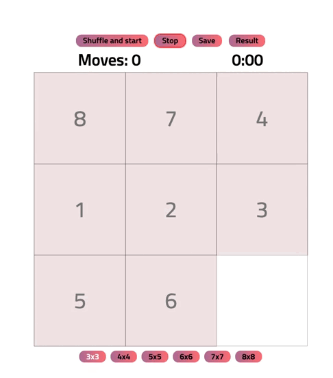

<h1 align="center"> <a href="https://gusap9.github.io/gem-puzzle/" target="_blank"> Gem Puzzle </a></h1>

## About 
Gem Puzzle is the classic puzzle game.

 </img>

## Rules
The game is a set of identical square dominoes with numbers printed on them, enclosed in a square box. The length of the side of the box is four times the length of the side of the dominoes for a set of 9/15/24/35/48/63 elements, one square field in the box remains unfilled. The goal of the game is to move the dominoes around the box to arrange them by number, preferably making as few movements as possible.

## Usage
To see the project you can directly visit

<a href="https://gusap9.github.io/gem-puzzle/" target="_blank"><code style="margin-left:40px">https://gusap9.github.io/gem-puzzle/</code></a>

